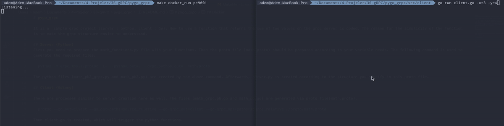

# pygo_grpc

It is a  sample grpc project (server : python, client : Go). There are two python functions that check whether the two values ​​it receives are equal to each other and add these two values. 
We will trigger these two functions using Go via gRPC. The reason for the simplicity of the function is to make the grpc structure easier to understand.

## Server (Python)
First you need to prepare the math_functions.py file with your functions. Then the proto file (math.proto) should be prepared according to your variable needs. The following command is used to generate the required files.
```
  python -m grpc_tools.protoc -I. --python_out=. --grpc_python_out=. math.proto
```
The python files (math_pb2_grpc.py and math_pb2.py) are created by the above command. Afterwards, server.py is created according to the structure you specify in this proto file.

## Client (Golang)

There are processes similar to server creation here as well. The files (math_grpc.pb.go and math_pb.go) are generated via proto file(math.proto).  
```
  protoc --go_out=client --go_opt=paths=source_relative --go-grpc_out=client --go-grpc_opt=paths=source_relative ./proto/math.proto
```
Then client.go is created, which will trigger the python functions.

## How to use ? 

First of all 
```
  make install
```
Usage (default port: 9001): 
```
  python src/server/server.py
``` 


After the above processes, grpc server has been activated. If you want to test the grpc server, you can run it with the following command. 

```
  go src/client/client.go -x=3 -y=2
  >>> result:5 message:"Not Equal"
```

```
  go src/client/client.go -x=5 -y=5
  >>> result:10 message:"Equal"
```
## Docker

If you want to use this project via docker (default image name --> pygo_grpc):
Install 
```
make docker
``` 
Usage:
``` 
make docker_run p=9001
``` 
After that
```
  go src/client/client.go -x=2 -y=2
  >>> result:4 message:"Equal"
```

